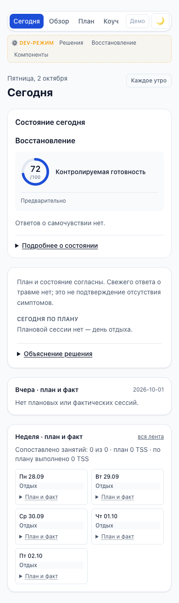
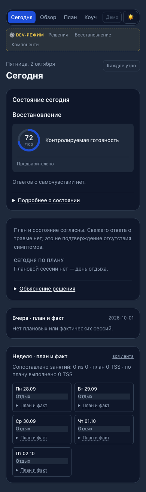
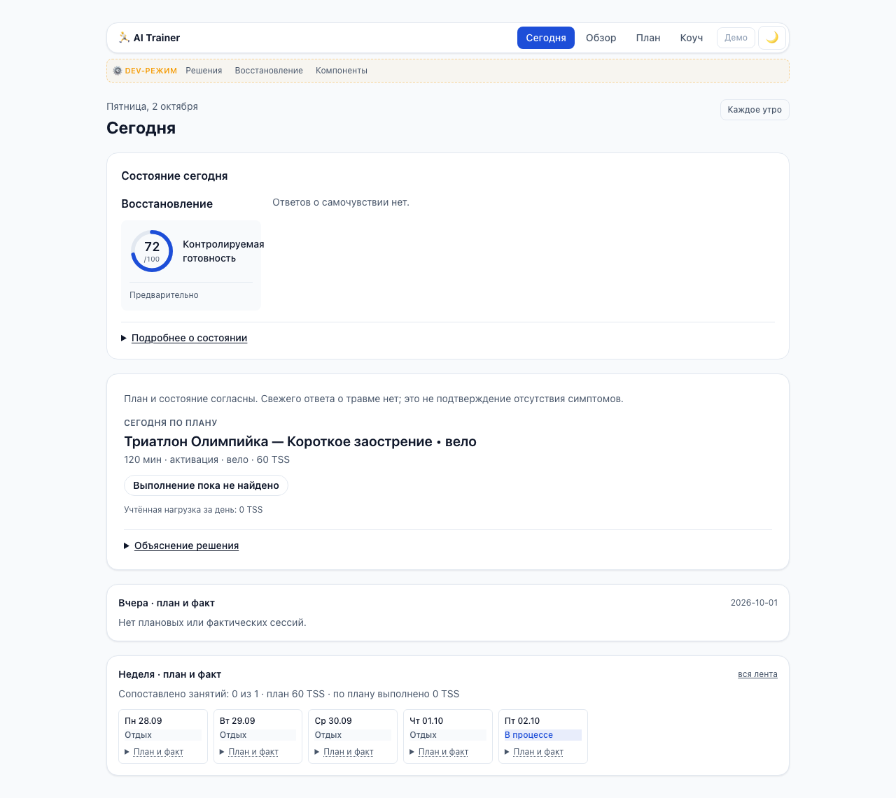

# #674: Today не создаёт тренировку на подтверждённом пустом дне

Class B — Standard. Issue: https://github.com/rbctmz/ai_trainer/issues/674. Продуктовый commit: `49d8f6116550e38f3daa2cde19063364a1389e76`, base `034bf8871d105d1f692994f6489038bc16bba3d7`. Luna — Domain/API Implementer; Sol — независимый Reviewer, затем Integrator. Новые DTO, изменение плана, readiness и UI-дизайна не входят в scope.

## Наблюдение и результат

**Observed:** настоящий генератор при нулевом бюджете оставляет название/роль активации, но выдаёт sport=off, duration=0, sessions=[]. После save/restore одного синтетического checkpoint Today возвращал карточку «велоактивации, 0 мин, 0 TSS», а Planning имел активный план без занятия на эту дату.

**Inferred:** в `_day_session` метаданные роли принимались за наличие занятия. Проверка, способная опровергнуть объяснение: заменить только activation на off; при остальных неизменных данных fallback-карточка исчезает.

**Verified by:** исходный probe на base034bf88 и два падающих saved-checkpoint регрессионных теста; после исправления оба пути Today возвращают session=null для подтверждённого пустого дня. Название и роль не доказывают наличие занятия. Экран уже показывает «Плановой сессии нет — день отдыха» при nullable session; CSS и frontend-правила не менялись.

Одна локальная проверка используется в report и template fallback. Она требует единственный согласованный день, явные пустые части нагрузки и список занятий, нулевые конечные числовые нагрузку/длительность, off/rest sport, отсутствие гонки. Optional template.total_tss проверяется только при наличии. Неполные, некорректные и противоречивые данные не получают нового подтверждения отдыха; существующая проекция сохраняется. Старые положительные планы проходят штатное восстановление.

## Граница evaluated-report

Штатный `upcoming_plan_sessions` пропускает tss<=0, поэтому обычное воспроизведение дефекта проходит template fallback. Проверка report-ветки — защитная проверка совместимости на контролируемой нулевой строке с согласованным sport_label=отдых.

Ранний исследовательский probe использовал общий helper с sport_label=бег при off-шаблоне. Это противоречащая строка, и исправление намеренно сохраняет прежнее отображение; отдельный тест закрепляет эту границу. Положительная или некорректная optional template.total_tss тоже не превращается в подтверждённый отдых.

## Проверки

| Проверка | Результат |
| --- | --- |
| RED двух исходных saved-checkpoint регрессий | 2 failed, 26 passed; [вывод](red.txt) |
| Today после scoped review correction | 30 passed; [вывод](final-today-green.txt) |
| Независимый focused Today/Coach/daily-story + точный review probe | 91 passed; [вывод](independent-focused.txt) |
| Contributor-safe полный набор | 2978 passed, 18 skipped, 46 deselected, 1 предупреждение зависимости; [вывод](contributor-safe.txt) |
| Ruff по всему репозиторию, git diff --check | passed |
| TS contract freshness, API inventory | passed |
| Web lint, production build | passed в временном экспорте тех же tracked исходников |
| Actual Today/Planning adapters после synthetic save/restore | 8 сценариев passed |
| Настоящие Next.js/Chromium, fixture HTTP delivery API payloads | 48 состояний: 8 сценариев × 390/978/1280 × светлая/тёмная темы |

Восемь сценариев: пустая activation через fallback и report, явный off, современное одиночное занятие, две независимые тренировки, брик, положительный legacy-план, отсутствие checkpoint. Active empty plan сохраняет has_plan=true; отсутствие checkpoint остаётся no_plan. Положительные занятия и этапы сохраняются. В браузере нет ошибок страницы, horizontal overflow, попыток записи, внешних или необработанных API-запросов. Интегратор также визуально осмотрел снимки пустого дня в обеих темах и настоящего занятия.

Релевантные tracked тесты воспроизводимы штатным contributor-safe pytest для `tests/smoke/test_api_today.py`, `test_daily_story_consistency.py`, `test_today_decision_story.py`, `test_coach_fresh_context.py`. Один дополнительный независимый probe вне tracked suite воспроизводит G1 через настоящее сохранение/восстановление.

Python запускался с блокировкой .env, сети и SQLite вне созданной временной папки. Полный набор выполнялся из проверенного временного экспорта исходников; зависимости web доступны через локальный read dependency link. Первый guarded full run дал44 guard failures из-за tempfile.mktemp вне выделенной папки, а22 проверки contracts/API inventory были skipped без web dependency link. После направления системных временных файлов внутрь того же root и подключения существующих зависимостей повторный запуск зелёный; защиту SQLite не ослабляли. Focused final91 также выполнен после этой коррекции окружения.

## Независимое ревью

Один consolidated full-code round, затем scoped delta. G1 blocking P2: optional template.total_tss=20.0 при нулевой daily row переживает save/restore, но первоначальный guard выдавал session=null. **fixed-in 49d8f61**, регрессия покрывает положительное и некорректное значение в обеих ветках. [Ревью и доказательства](independent-review.md), [review RED](review-regression-red.txt). На финальном кандидате открытых блокирующих замечаний нет. Native GitHub review, remote CI и owner acceptance не подменяются локальными проверками.

## Изолированный экран

Все метрики синтетические. HTTP-ответ Today получен от настоящего адаптера кандидата после save/restore; readiness/recovery report контролировались helpers. Настоящий Next.js UI получил зафиксированный payload через Playwright routing, не через живой API/личную БД. Дополнительные adherence/session-projection payloads также построены кандидатными адаптерами/сервисами. Это проверка экрана на API-данных, а не live-provider или athlete pilot.

## Ограничения

Живая БД, рабочий localhost и внешние провайдеры не трогались. Почему именно в личном плане возник нулевой бюджет активации, не установлено. Дефект отображения исправлен; генератор нагрузки не переписывался. Live LLM, атлеты и screen reader не проверялись. Временные Python/browser runtime каталоги удалены, Next.js process group остановлена. Главная рабочая копия остаётся чистой на main. Мёрж — решение владельца.
